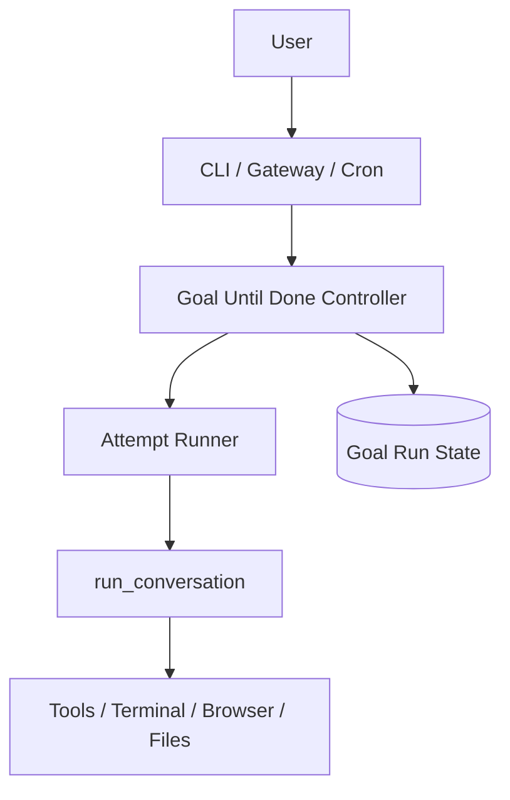
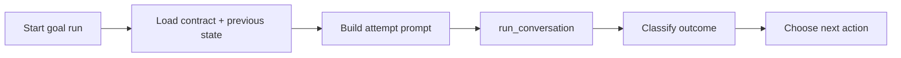
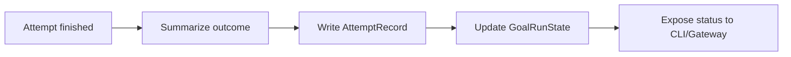
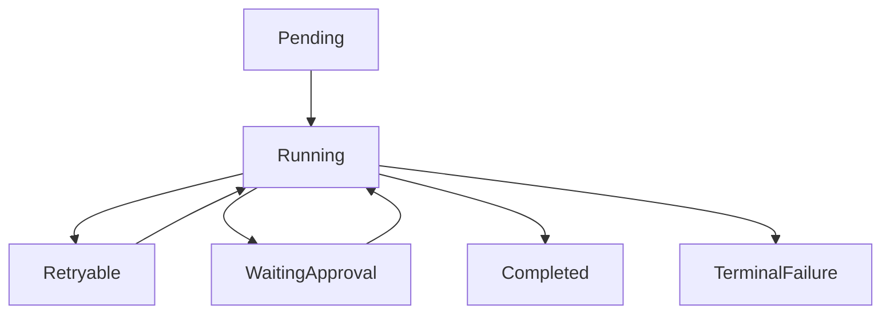

# Goal-Until-Done PRD

> **For Hermes:** this is the SSOT for adding a goal-bound execution mode that keeps working until explicit completion criteria are met or a terminal blocker is reached.

**Goal:** Hermes에 `goal-until-done` 실행 모드를 추가해, 단순 `max_turns` bounded loop를 넘어 목표 완료 기준을 붙잡고 재시도/재개/중단 판정을 시스템적으로 수행하게 만든다.

**Architecture:** 기존 `run_agent.py`의 tool-calling loop는 유지하되, 그 바깥에 `goal contract` + `attempt runner` + `blocker classifier`를 얹는다. interactive/CLI/background/cron이 같은 contract를 공유하고, `run_conversation()`은 한 번의 attempt executor로 남긴다.

**Tech Stack:** Python, existing `AIAgent`, `cli.py`, `cron/scheduler.py`, SQLite session store, prompt/tool orchestration

---

## 1. 문서 목적
이 문서는 Hermes core에 추가할 `goal-until-done` 실행 모드의 제품/시스템 요구사항을 정의한다.

이 기능의 목적은:
- 목표 완료 조건을 명시적으로 붙잡기
- 한 번의 대화 루프 실패를 전체 작업 실패로 보지 않기
- retryable blocker와 terminal blocker를 구분하기
- interactive / background / cron에서 같은 완료 의미를 쓰기

## 2. Absolute Principles / Non-Goals
### 원칙
1. `run_conversation()`은 한 번의 attempt executor로 유지한다.
2. 완료 여부는 모델의 느낌이 아니라 **contract**로 판정한다.
3. retry 가능한 실패는 자동 재시도한다.
4. 사용자 승인 없이는 위험한 side effect를 확대하지 않는다.
5. interactive 세션과 cron 세션은 동일한 goal contract 구조를 공유한다.

### Non-goals
- 무한 루프 허용
- 모든 실패를 자동 해결하는 범용 자율성 환상
- clarify가 필요한 상황을 억지로 무시하고 진행
- 기존 `max_turns` / cron inactivity timeout 제거

## 3. Problem Definition
현재 Hermes는 아래는 가능하다.
- `run_conversation()`의 bounded tool loop
- `agent.max_turns` 조절
- cron의 inactivity-based long run

하지만 아래는 부족하다.
- explicit completion contract
- retry / resume / polling / carry-forward를 하나의 실행 모드로 묶기
- “아직 안 끝났지만 막혔다”와 “진짜 끝났다”를 시스템적으로 구분하기

즉 현재는 “오래 돌 수는 있지만, 목표가 완료될 때까지 집요하게 붙는 모드”가 없다.

## 4. What to Borrow vs What NOT to Borrow
### Borrow
- cron의 inactivity timeout 감시
- existing iteration budget / activity tracker
- session persistence / SQLite transcript store
- background task surface and slash-command ergonomics

### Do NOT Borrow
- cron의 fresh-session-only 제약을 interactive에 그대로 적용
- 단순 `max_turns` 증가를 곧 autonomy로 보는 접근
- tool denial / approval 필요 상태를 retryable 상태와 혼동하는 접근

## 5. Product / Architecture Goals
1. 사용자가 goal과 done criteria를 명시할 수 있어야 한다.
2. Hermes가 한 번의 attempt 실패 후에도 다음 attempt를 조직할 수 있어야 한다.
3. retryable / waitable / approval-needed / terminal blocker를 구분해야 한다.
4. background와 cron이 같은 contract를 실행할 수 있어야 한다.
5. session에 현재 goal 상태와 마지막 blocker 이유가 남아야 한다.

## 6. Scope
### In scope
- new goal contract schema
- CLI/interactive command surface
- attempt orchestrator
- blocker classification
- carry-forward state summary
- status inspection surface

### Out of scope
- distributed queue system
- external worker fleet
- autonomous web polling infra beyond existing tools
- generalized workflow engine / BPM system

## 7. Proposed Architecture Layers
### Layer 1: Goal Contract
정적 입력.
- goal
- done_when
- constraints
- non_goals
- blocker_policy
- retry_policy
- max_attempts
- max_runtime_seconds
- max_idle_seconds
- approval_policy

### Layer 2: Attempt Runner
한 번의 `run_conversation()` 호출을 감싼다.
- prompt assembly
- previous attempt summary injection
- result capture
- activity / idle / timeout capture

### Layer 3: Outcome Classifier
attempt 결과를 분류한다.
- completed
- retryable_failure
- wait_and_retry
- approval_required
- terminal_blocker
- budget_exhausted

### Layer 4: Goal Loop Controller
분류 결과에 따라 다음 행동을 정한다.
- retry now
- sleep then retry
- pause awaiting approval
- mark complete
- mark terminal failure

### Layer 5: State Persistence / Inspection
- current goal contract 저장
- attempt history 저장
- latest blocker / next action 저장
- `/status` 또는 전용 명령으로 조회

## 8. Core Entities
### GoalContract
```json
{
  "goal": "Ship feature X",
  "done_when": [
    "tests pass",
    "user-facing file Y exists",
    "manual QA checklist complete"
  ],
  "constraints": ["no schema migration", "keep API backward compatible"],
  "non_goals": ["do not redesign UI"],
  "retry_policy": {
    "max_attempts": 5,
    "backoff_seconds": [0, 30, 120]
  },
  "max_runtime_seconds": 7200,
  "max_idle_seconds": 600,
  "approval_policy": "pause",
  "blocker_policy": "classify"
}
```

### GoalRunState
- run_id
- session_id
- contract
- status
- attempts_used
- last_attempt_summary
- last_blocker_type
- next_action
- updated_at

### AttemptRecord
- attempt_index
- started_at
- finished_at
- result_summary
- classifier_label
- budget_used
- idle_seconds
- tool_failures

## 9. Mermaid Diagrams
### System Context


### Read Path


### Write Path


### Maintenance / Lifecycle Loop


## 10. Detailed Design by Subsystem
### A. CLI / Slash Command Surface
후보 surface:
- `hermes chat --until-done`
- `/until-done <goal>`
- `/goal-status`
- `/goal-stop`
- `/goal-resume`

### B. Prompt Contract Injection
attempt prompt에는 항상 포함한다.
- final goal
- explicit done criteria
- current attempt number
- last blocker summary
- do/don't rules

### C. Blocker Classification Rules
최소 분류:
- approval_required
- external_wait
- retryable_tool_failure
- retryable_api_failure
- terminal_scope_gap
- terminal_permission_denied
- completed

### D. Retry Policy
- immediate retry
- backoff retry
- sleep-until retry
- human approval pause

### E. Persistence
초기 버전은 session DB + JSON sidecar 둘 중 하나를 택할 수 있다.
권장: `~/.hermes/goals/` 아래 JSON state + session transcript linkage.

## 11. Phase Priorities
### Phase 1 — Foundation
- goal contract
- attempt loop wrapper
- status persistence
- CLI one-shot entrypoint

### Phase 2 — Interactive control
- slash commands
- pause/resume/stop
- status display

### Phase 3 — Cron/background convergence
- cron reuse
- background task adoption
- retry/backoff improvements

## 12. Operating Rules
- 기존 bounded loop는 그대로 유지한다.
- goal-until-done은 opt-in mode다.
- clarify/approval이 필요하면 contract policy에 따라 pause한다.
- completed 판정은 explicit done_when에 매칭돼야 한다.

## 13. Implementation Checklist / Next Steps
- [ ] Goal contract schema 정의
- [ ] attempt outcome classifier 추가
- [ ] goal loop controller 추가
- [ ] CLI/slash command surface 추가
- [ ] state persistence 추가
- [ ] narrow tests 작성
- [ ] targeted pytest 실행

## PRD Guardrails
- Hermes core 변경 대상이 맞다.
- 서드파티 프로젝트 참조가 아니라 Hermes 자체 기능 추가다.
- 이 PRD가 기능 SSOT다.
- PRD와 Mermaid는 함께 유지한다.
